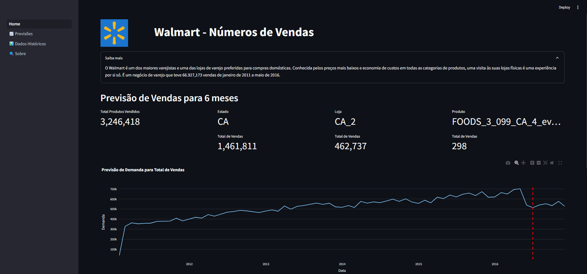
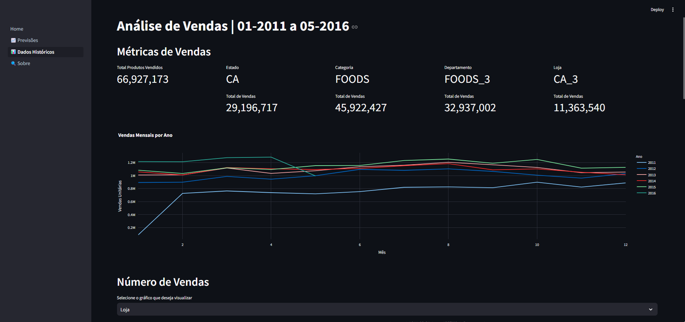
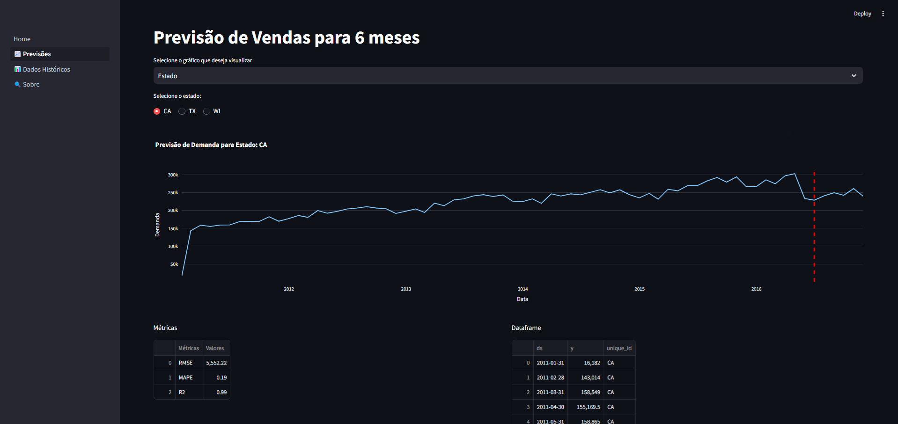
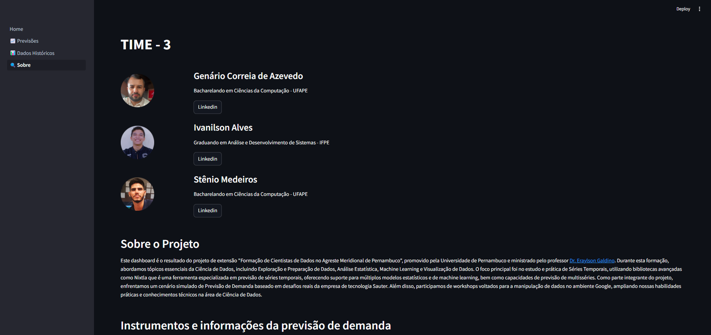

# Dashboard README

## Projeto de Extensão: Formação de Cientistas de Dados no Agreste Meridional de Pernambuco

### Descrição
Este dashboard é o resultado do projeto de extensão "Formação de Cientistas de Dados no Agreste Meridional de Pernambuco", promovido pela Universidade de Pernambuco e ministrado pelo professor [Dr. Eraylson Galdino](https://www.linkedin.com/in/eraylson/). Durante esta formação, abordamos tópicos essenciais da Ciência de Dados, incluindo Exploração e Preparação de Dados, Análise Estatística, Machine Learning e Visualização de Dados.

O foco principal foi no estudo e prática de Séries Temporais, utilizando bibliotecas avançadas como Nixtla, que é uma ferramenta especializada em previsão de séries temporais, oferecendo suporte para múltiplos modelos estatísticos e de machine learning, bem como capacidades de previsão de multisséries. Como parte integrante do projeto, enfrentamos um cenário simulado de Previsão de Demanda baseado em desafios reais da empresa de tecnologia Sauter. Além disso, participamos de workshops voltados para a manipulação de dados no ambiente Google, ampliando nossas habilidades práticas e conhecimentos técnicos na área de Ciência de Dados.

Para a construção dos modelos de previsão dos dados de venda do Walmart, foi realizado um processo criterioso de análise exploratória e transformação dos dados, a fim de extrair inferências valiosas para todo o processo. Utilizou-se o framework Nixtla com a biblioteca MlForecast para a construção do modelo, onde foram avaliados os modelos XGBRegressor, SVR, LinearRegression, RandomForestRegressor, utilizando as métricas RMSE, MAPE e R2. Após a avaliação e validação dos dados, o modelo RandomForestRegressor foi definido como o melhor preditor.

### Telas







### Requisitos para Funcionamento

#### Instalação do Ambiente Python
1. Certifique-se de ter o Python 3.8 ou superior instalado. Você pode baixá-lo do [site oficial do Python](https://www.python.org/downloads/).

#### Instalação das Bibliotecas Necessárias
As bibliotecas necessárias para o funcionamento deste dashboard são `pandas`, `streamlit` e `plotly.express`. Para instalar essas bibliotecas, siga as instruções abaixo:

1. **Crie um ambiente virtual** (opcional, mas recomendado):
    ```bash
    python -m venv meu_ambiente
    source meu_ambiente/bin/activate  # Para Linux/Mac
    .\meu_ambiente\Scripts\activate  # Para Windows
    ```

2. **Instale as bibliotecas**:
    ```bash
    pip install pandas
    pip install streamlit
    pip install plotly.express
   ```

### Executando o Dashboard
Para executar o dashboard, utilize o comando abaixo no terminal:
```bash
streamlit run Home.py
